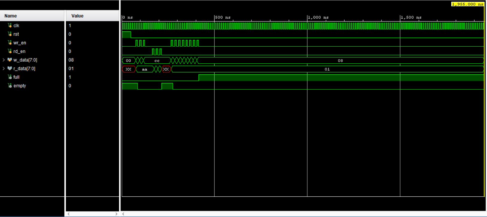

# Parametric Synchronous FIFO Memory Buffer

A fully synthesizable, parameterizable Synchronous FIFO (First-In, First-Out) memory queue implemented in Verilog HDL. This module is designed to handle safe data buffering and queue management between synchronous digital blocks or mismatched processing rates.

---

## 📐 Project Architecture

The design uses a dual-port register array with tracking pointer logic to handle data storage and status flag generation dynamically:

* **Dual-Port Memory Array**: Configurable memory depth and data width using Verilog parameters (`DATA_WIDTH` and `ADDR_WIDTH`).
* **Write Pointer (`w_ptr_reg`)**: Automatically increments on valid write requests (`wr_en`) to track the next available memory slot.
* **Read Pointer (`r_ptr_reg`)**: Increments on valid read requests (`rd_en`) to track the next data byte to be extracted.
* **Status Flag Logic**: Combinational comparison circuitry that detects pointer orientation to accurately toggle `full` and `empty` flags, preventing memory overwrite or underflow conditions.

---

## 🧪 Simulation & Verification

The architecture was thoroughly verified via a custom behavioral testbench (`tb_fifo.v`) using the Xilinx Vivado simulation engine. The simulation models a full operational lifecycle:
1. **Sequential Writes**: Queued independent data bytes (`8'hAA`, `8'hBB`, `8'hCC`) into the buffer.
2. **Sequential Reads**: Verified precise First-In, First-Out retrieval ordering, validating data integrity.
3. **Boundary Condition Testing**: Filled the FIFO to maximum capacity to confirm the `full` flag asserts cleanly and blocks further writes.

### Functional Verification Waveform

